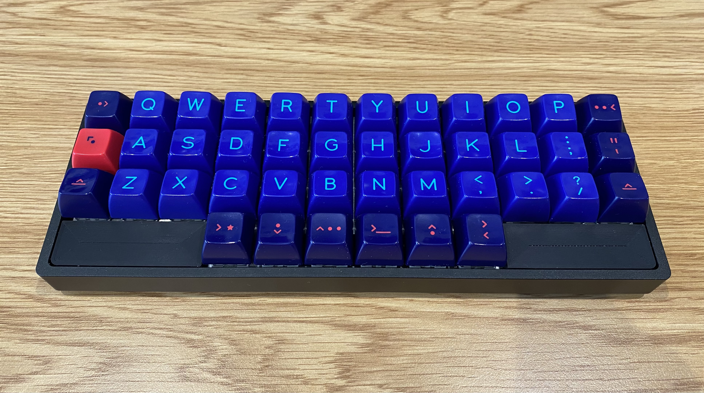

# Planck Blank Plank

3D models for blanking plates for the OLKB Planck keyboard that cover the bottom
three keys on each side of the keyboard, which essentially makes the Planck
similar to the Corne keyboard layout. Designed to work with the high profile
case with plate mount. Glue may be necessary.

Below is my keyboard; printed on a Prusa Mini+, 0.1mm Detail, with concentric
bottom fill (the visible surface).

